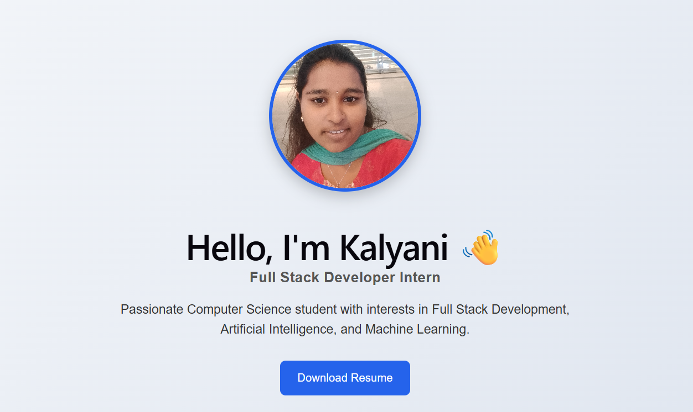

# 🌐 MERN Portfolio Website

A modern full-stack personal portfolio website built using the **MERN Stack (MongoDB, Express.js, React.js, Node.js)**. This portfolio showcases my skills, projects, certifications, and provides a contact system with backend API integration.

## 🚀 Live Demo

Frontend:
🔗 Add your Vercel URL here

Backend API:
🔗 Add your Render URL here

---

## 📌 About The Project

This project is a full-stack portfolio application developed to present my technical skills, projects, and professional journey.

The application includes a responsive frontend built with React.js, a backend REST API using Node.js and Express.js, and MongoDB Atlas for storing project and contact information.

---

## ✨ Features

### Frontend

* Responsive personal portfolio design
* Modern UI using React.js
* Navigation between sections
* About Me section
* Skills showcase
* Projects display
* Contact form
* API integration using Axios

### Backend

* REST API development using Express.js
* MongoDB Atlas database integration
* Project data management
* Contact form data storage
* CORS configuration
* Environment variable support

---

## 🛠️ Tech Stack

### Frontend

* React.js
* JavaScript
* HTML5
* CSS3
* Axios
* Vite

### Backend

* Node.js
* Express.js
* Mongoose

### Database

* MongoDB Atlas

### Deployment

* Vercel (Frontend)
* Render (Backend)

### Tools

* VS Code
* Git
* GitHub
* Postman
* MongoDB Atlas

---

## 📂 Project Structure

```
PortfolioWebsite/
│
├── client/
│   ├── src/
│   ├── public/
│   ├── package.json
│
├── server/
│   ├── models/
│   ├── routes/
│   ├── server.js
│   ├── package.json
│
├── README.md
├── package.json
└── .gitignore
```

---

## ⚙️ Installation & Setup

### 1. Clone Repository

```bash
git clone https://github.com/KalyaniVanga/portfolio.git
```

### 2. Navigate to Project Folder

```bash
cd PortfolioWebsite
```

---

## Frontend Setup

Navigate to client folder:

```bash
cd client
```

Install dependencies:

```bash
npm install
```

Run frontend:

```bash
npm run dev
```

Frontend runs on:

```
http://localhost:5173
```

---

## Backend Setup

Navigate to server folder:

```bash
cd server
```

Install dependencies:

```bash
npm install
```

Create `.env` file:

```
MONGO_URI=your_mongodb_connection_string
PORT=5000
```

Run backend:

```bash
npm start
```

Backend runs on:

```
http://localhost:5000
```

---

## 🔗 API Endpoints

### Get Projects

```
GET /api/projects
```

Returns all portfolio projects.

---

### Submit Contact Form

```
POST /api/contact
```

Stores user contact information in MongoDB.

---

## 📸 Screenshots

Add your project screenshots here:

* Home Page
* About Section
* Skills Section
* Projects Section
* Contact Form

Example:

```

```

---

## 📚 Projects Included

### Smart Pothole Detection

AI-based pothole detection system using computer vision techniques.

### Machine Learning Projects

* Sales Demand Forecasting
* Resume Candidate Screening
* Ticket Classification System

### Personal Portfolio Website

A complete MERN stack portfolio application with database and deployment.

---

## 🎯 Future Enhancements

* Add authentication system
* Add admin dashboard
* Add project filtering
* Improve animations and UI
* Add blog section

---

## 👩‍💻 Author

**Kalyani Vanga**

B.Tech Computer Science Engineering Student

GitHub:
https://github.com/KalyaniVanga

LinkedIn:
Add your LinkedIn URL here

---

## ⭐ Acknowledgements

Thanks to open-source communities and learning platforms that helped in building this project.
